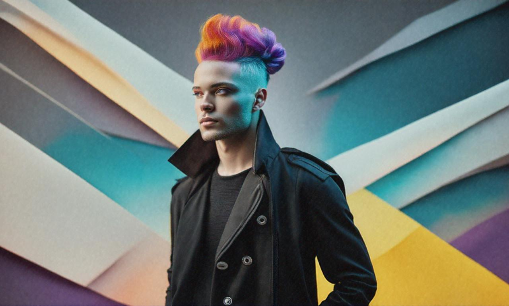
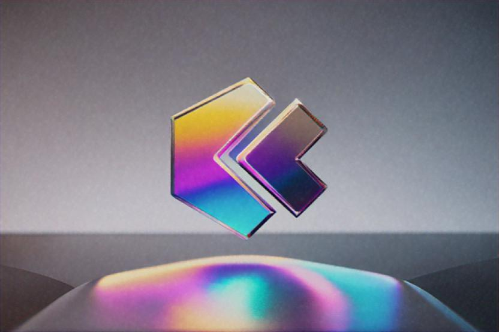
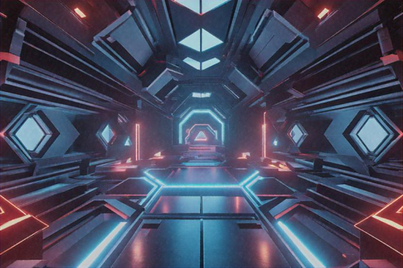
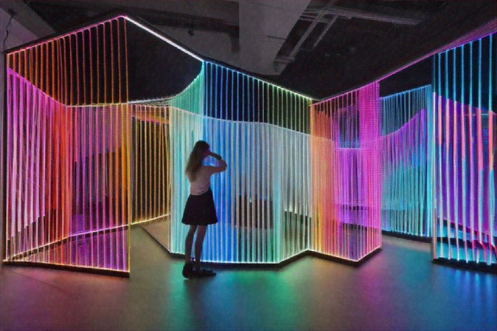
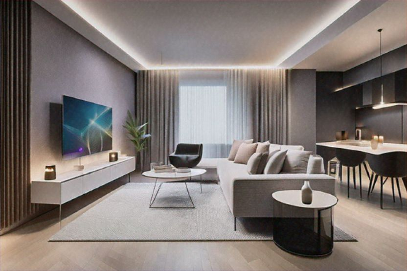
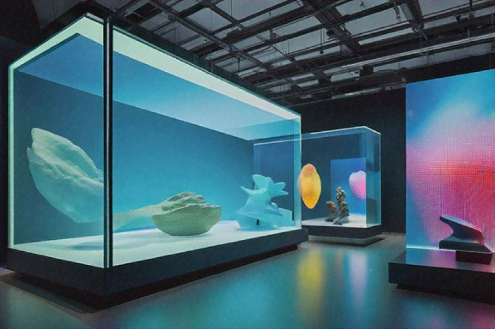
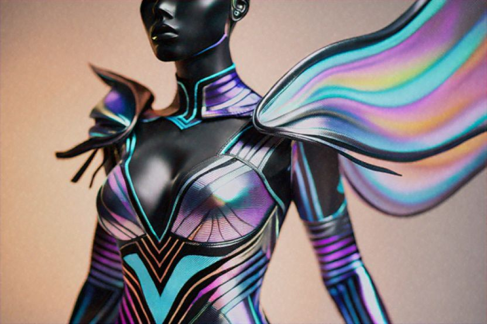
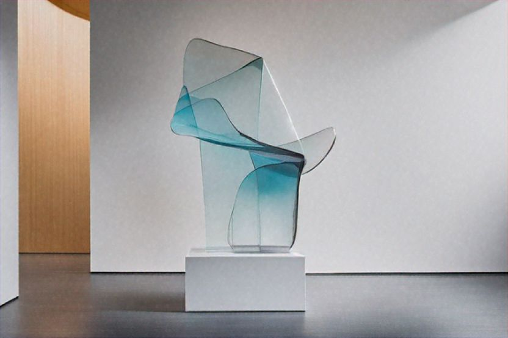

<!DOCTYPE html>
<html lang="en">
<head>
    <meta charset="UTF-8">
    <meta name="viewport" content="width=device-width, initial-scale=1.0">
    <title>AR Portfolio</title>
    <link rel="stylesheet" href="endsem.css">

   
</head>
<body>
    

        

            

                <a href="#">Home</a>
                <a href="#">Projects</a>
                <a href="#">About</a>
            

            

                <h1>ARFOLIO</h1>
            

            

                <a style="text-decoration: none;
                color: #000;font-family:'Roboto Mono', monospace;
                ;font-size: 16px;" href="#" >Contact</a>
            

        

        

            <h2>BRIDGING DIGITAL AND PHYSICAL DESIGN</h2>
            
        

        

            
Innovative designer blending AR with traditional aesthetics. Part digital, part physical, always cutting-edge.

        

        

            
        

        

            

                

                    
                    
Holographic Branding

                    
AR Design

                

                

                    
                    
Virtual Reality Spaces

                    
VR Design

                

                

                    
                    
Digital Sculpture

                    
3D Art

                

            

            

                

                    
                    
Interactive Installations

                    
Experiential Design

                

                

                    
                    
Augmented Interiors

                    
Interior Design

                

                

                    
                    
Mixed Reality Exhibits

                    
Exhibit Design

                

            

            

                

                    
                    
Virtual Fashion

                    
Fashion Design

                

                

                    
                    
3D Printed Art

                    
Sculpture

                

                

                    
                    
HoloLens Prototypes

                    
Prototyping

                

            

        

        

            <h2>What Our Clients Say</h2>
            

                

                    
                    

                        Aurelia F.   
                        Creative Director, Future Visions
                        

                        
A revolutionary approach to design.

                    

                

                

                    
                    

                        Leona R.
                        Founder, ArtSpace
                        

                        
Transformed our brand with AR.

                    

                

                

                    
                    

                        Darius T.
                        Head of Design, Immersive Worlds
                        

                        
Pioneering work in mixed reality.

                    

                

                

                    
                    

                        Aurelia F.   
                        CEO, Tech Innovators
                        

                        
Exceptional design and execution.

                    

                

            

        

        <!-- Full-width line -->
        

        

            
Our Impact

            

                

                    
150+

                    
Projects Completed

                

                

                    
50+

                    
Satisfied Clients

                

                

                    
10

                    
Years of Experience

                

                

                    
5

                    
Industry Awards

                

            

        

        

            

                
©

                
2024 ARFOLIO. All rights reserved.

            

            

                

                    <a href="#">Contact Us</a>
                

            

        

    

</body>
</html>
